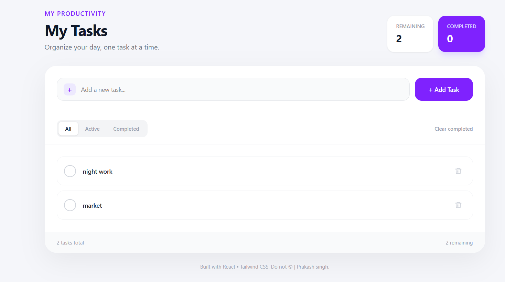

# TaskFlow — Modern React Task Management Application

[](https://react.dev/)
[](https://vite.dev/)
[](https://tailwindcss.com/)
[](#license)

A clean, responsive, and minimalist task management web application built with **React 19** and **Tailwind CSS v4**. It helps users track daily tasks, organize their workflow with dynamic filtering, monitor completion progress in real time, and persist task data across browser sessions using local storage.

---

## 📌 Project Overview

Staying organized and managing daily responsibilities can quickly become overwhelming when tasks are scattered. **TaskFlow** (todo-app-project) was developed to provide a focused, distraction-free environment for day-to-day task tracking.

Rather than over-complicating task management with unnecessary layers of configuration, this application prioritizes:
- **Simplicity & Speed:** Instantly capture thoughts and tasks with standard keyboard inputs.
- **Visual Clarity:** Clear visual cues, distinct status badges, and subtle animations keep tasks easy to scan.
- **Reliable Persistence:** Automatic local storage synchronization ensures you never lose your task list upon page reloads.

This project was built from scratch as part of my frontend development journey to master modern React 19 fundamentals, hooks, and utility-first styling with Tailwind CSS.

---
## 📸 Screenshots

### TaskFlow — Application Preview




---

## ✨ Key Features

The following features are directly implemented in the codebase:

- **Task Creation:** Add new items instantly via the text input and `+ Add Task` button with automatic whitespace trimming.
- **Keyboard Productivity:** Press <kbd>Enter</kbd> inside the task input to create a task without touching the mouse.
- **Task Completion Toggle:** Mark items as completed or active with a single click. Completed items dynamically update with custom checkmark indicators and strikethrough styling.
- **Task Deletion:** Remove individual items permanently using the dedicated delete action button.
- **Batch Clear Completed:** Clean up finished work in bulk with the one-click `Clear completed` button.
- **Status Filtering:** Switch effortlessly between view tabs:
  - **All:** View every task currently recorded.
  - **Active:** View only pending tasks that require attention.
  - **Completed:** View finished tasks.
- **Real-Time Productivity Metrics:**
  - Live **Remaining** counter badge.
  - Live **Completed** counter badge.
  - Footer counter displaying total tasks and remaining task counts.
- **Empty State Feedback:** Displays an intuitive empty-state illustration (`✓ No tasks found`) when no tasks exist or when a filter yields no results.
- **Local Storage Persistence:** Automatically saves all task updates to the browser's `localStorage` via React lifecycle hooks, preserving state between tab closures and reloads.
- **Responsive Interface:** Fully responsive UI crafted with Tailwind CSS that adapts smoothly across mobile devices, tablets, and desktop screens.

---

## 🛠️ Tech Stack

### Core Technologies & Libraries

| Technology | Version | Purpose |
| :--- | :--- | :--- |
| **[React](https://react.dev/)** | `^19.2.8` | Component-based UI library & reactive state management |
| **[React DOM](https://react.dev/)** | `^19.2.8` | DOM rendering package for React |
| **[Tailwind CSS](https://tailwindcss.com/)** | `^4.3.3` | Utility-first CSS framework for modern, responsive UI design |
| **[@tailwindcss/vite](https://tailwindcss.com/)** | `^4.3.3` | Official Vite plugin for Tailwind CSS v4 compilation |
| **[Vite](https://vite.dev/)** | `^8.3.0` | Next-generation frontend build tool and rapid development server |
| **[ESLint](https://eslint.org/)** | `^10.10.0` | Static code analysis and React linting rules |
| **Browser Web API** | Native | `localStorage` API for client-side persistent storage |

---

## 📁 Project Structure

```text
todo-app/
├── public/
│   ├── favicon.svg          # Application favicon
│   └── icons.svg            # Static icon assets
├── src/
│   ├── assets/
│   │   ├── hero.png         # Brand & preview graphics
│   │   ├── react.svg        # React logo asset
│   │   └── vite.svg         # Vite logo asset
│   ├── components/
│   │   └── Navbar.jsx       # Reusable navigation bar component
│   ├── App.css              # Application-specific styles (Tailwind import)
│   ├── App.jsx              # Main application component & core state logic
│   ├── index.css            # Global CSS styles (Tailwind import)
│   └── main.jsx             # React DOM entry point & root renderer
├── .gitignore               # Files and directories ignored by Git
├── eslint.config.js         # ESLint configuration
├── index.html               # Main HTML entry file
├── package.json             # Project metadata, dependencies, and npm scripts
├── package-lock.json        # Deterministic dependency lock file
├── vite.config.js           # Vite build and Tailwind plugin configuration
└── README.md                # Project documentation
```

---

## 🚀 Getting Started

Follow the steps below to set up and run this project locally on your machine.

### Prerequisites

Make sure you have the following installed on your system:
- **[Node.js](https://nodejs.org/)** (v18.0.0 or higher recommended)
- **[npm](https://www.npmjs.com/)** (comes pre-packaged with Node.js) or another package manager (yarn / pnpm)
- **[Git](https://git-scm.com/)**

---

## 💻 Run Locally

1. **Clone the repository:**
   ```bash
   git clone https://github.com/your-username/todo-app.git
   ```

2. **Navigate into the project directory:**
   ```bash
   cd todo-app
   ```

3. **Install the dependencies:**
   ```bash
   npm install
   ```

4. **Start the development server:**
   ```bash
   npm run dev
   ```

5. **Open in your browser:**
   Open your browser and navigate to the local server URL displayed in your terminal (usually `http://localhost:5173`).

### Available NPM Scripts

From `package.json`:

- `npm run dev` — Starts the local Vite development server with Hot Module Replacement (HMR).
- `npm run build` — Compiles and bundles production-ready assets into the `dist/` directory.
- `npm run preview` — Locally previews the generated production build.
- `npm run lint` — Runs ESLint to check for code quality and style issues.

---

## 📖 How to Use

1. **Add a Task:**
   - Type your task description into the **"Add a new task..."** input field.
   - Click the **"+ Add Task"** button or press the **<kbd>Enter</kbd>** key.
2. **Mark a Task as Completed:**
   - Click the circular checkmark button beside the task.
   - The task text will display with a line-through styling and the counters will update immediately.
3. **Filter Your Tasks:**
   - Use the filter tabs at the top of the task card:
     - Click **All** to display every task.
     - Click **Active** to display only unfinished tasks.
     - Click **Completed** to view finished tasks.
4. **Remove a Single Task:**
   - Click the **Trash / Delete** icon button on the right side of any individual task row.
5. **Clear All Completed Tasks:**
   - Click the **"Clear completed"** button in the filter bar to remove all completed tasks simultaneously.
6. **Data Persistence:**
   - Close or refresh the browser anytime; your tasks will automatically reload exactly as you left them.

---

## 🧠 What I Learned

Building this application provided practical, hands-on experience with core modern frontend concepts:

- **React 19 Hooks & State Architecture:**
  - Implemented `useState` with lazy initial state evaluation (`useState(() => JSON.parse(localStorage.getItem("todos")) || [])`), avoiding unnecessary `localStorage` reads on subsequent re-renders.
  - Used `useEffect` to establish a clean synchronization pipeline between component state and client storage.
- **Immutable State Management:**
  - Applied immutability principles using JavaScript array methods (`.map()`, `.filter()`, and spread operators `[...]`) to handle task addition, status toggling, and removal cleanly without side effects.
- **Derived State vs. Redundant State:**
  - Computed values like `remaining`, `completed`, and `filteredTodos` dynamically on render from base state rather than introducing duplicate state variables, preventing state desynchronization bugs.
- **Tailwind CSS v4 Integration:**
  - Configured Tailwind CSS v4 using the modern `@tailwindcss/vite` plugin and `@import "tailwindcss";` syntax.
  - Designed custom UI components leveraging responsive modifiers (`sm:`, `md:`), interactive states (`hover:`, `active:scale-95`, `focus:ring-4`), and clean color palettes.
- **Build Tooling & Modern Bundlers:**
  - Gained familiarity with Vite's rapid build cycles, ES Modules, and ESLint flat config setup.

---

## 🔮 Future Improvements

Here are realistic features planned for future updates:

- [ ] **Task Editing:** Inline double-click or modal edit functionality to update task names without recreating them.
- [ ] **Due Dates & Priorities:** Add date pickers and priority tags (High, Medium, Low) for better time management.
- [ ] **Drag-and-Drop Reordering:** Enable manual task ordering using libraries like `@dnd-kit` or `framer-motion`.
- [ ] **Category Tags / Projects:** Group tasks into custom tags (e.g., Work, Personal, Study).
- [ ] **Dark Mode Toggle:** Implement a theme switch for comfortable night-time task management.
- [ ] **Cloud Backend Synchronization:** Connect to a backend database (such as Firebase or Supabase) with user authentication for cross-device access.

---

## 👨‍💻 Author

**Prakash Kumar**  
- **Portfolio:** [https://prakash-kumar12.netlify.app/](https://prakash-kumar12.netlify.app/)
- **Role:** Frontend Developer / React Developer

---

## 🔗 GitHub Repository

- **Repository Link:** `https://github.com/your-username/todo-app` *(Replace `your-username/todo-app` with your actual repository URL when published)*

---

## 📄 License

This repository does not currently contain a license file. 

If you plan to make this project open source, consider adding an **MIT License** by creating a `LICENSE` file in the root directory:

```text
 License

Copyright (c) 2025 Prakash Kumar

This project is currently not distributed under a specific open-source license. All rights are reserved by the author unless otherwise stated.

```
